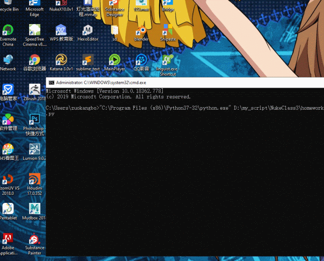
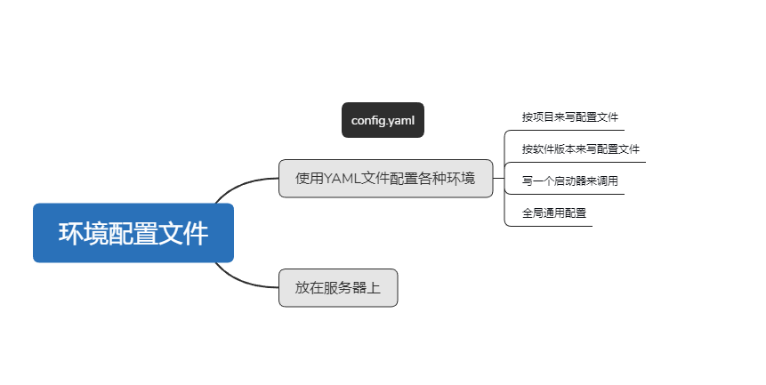

# 第11课作业
---
**请将课程附件案例(本文件夹中的zip压缩包）中的所有插件加载到Nuke中，并编写一个测试函数或测试模块，一次性测试所有插件是否都已正确加载。**

**不同项目往往需要不同的Nuke环境（加载不同的插件），请设计一个方案来实现这一需求。**

你需要提供一个能够加载所有插件的脚本，并提供一个测试函数或测试模块。请特别注意dll类型的插件只能在相兼容的Nuke版本中使用，
请测试一下你所使用的Nuke版本是否兼容它们，如果不兼容就不用加载它们。

对于第二个作业，你可以画图，写文字设计方案，或者写代码。

# 第一个作业
-----

----
# 第二个作业：
  

可以利用yaml来配置不同的nuke环境，可以按项目或者软件版本去配置  
然后写一个有不同情况或者项目的启动器