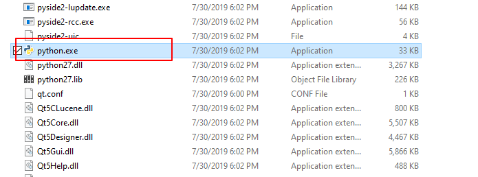

# **使用说明**
----------
### 介绍：
----
此脚本主要是运用终端渲染输出nuke文件
------
### 如何使用：
这里有两种方法开始工作前的准备。
* 设置一个自定义的环境变量，如这里的NUKE_PATH_a：你nuke的路径包好exe的后缀
* 或者手动输入到终端输入框中运行   
**使用工作流如下：**   
1、打开cmd窗口，把NukeBacthRender.py文件拖入cmd窗口中回车（确保你的电脑安装了Python,如果没有安装请参见[1.使用nuke自带Python](#1)）
2、准备好你需要渲染的nuke工程文件，并且保证你Nuke工程的Write节点设置，Project Settings都没问题的保存好了的情况下进行的。
3、根据提示在cmd窗口中输入需要设置的值
4、后面提供了两个选项，1是保存为一个bat文件，下次还可以在快速执行，2是执行执行当前的任务
----------
目前最常用的就这些了，还有更多的玩法欢迎互相交流学习。
### 扩展案例补充
我们保存出来的bat文件可以自行修改后继续使用，跟进下面我给的一些参考应该就容易理解了。（感兴趣的可以自行尝试）  
```
nuke路径 -F 1-100 -X Write1 工程文件的路径.nk
```
* -F 是Frame帧的意思。1-100是要渲染的帧范围（不能超过你工程文件里面的设置）。

* -X 注意X是大写，这里的意思是选择Nuke里的Write渲染节点名称，如果一个NK工程有多个输出节点，就可以选择性输出。（名称一定要输对）  
如果有多个工程文件，也有多个输出节点可以在下面继续加命令，当第一个任务完成后会逐行进行。

<h2 id="1">1.使用nuke自带Python</h2>
打开cmd，在nuke的安装目录下找到Python.exe文件，拖拽到cmd窗口中，然后空格，在把需要执行的文件拖拽到后面，最后回车运行程序。

