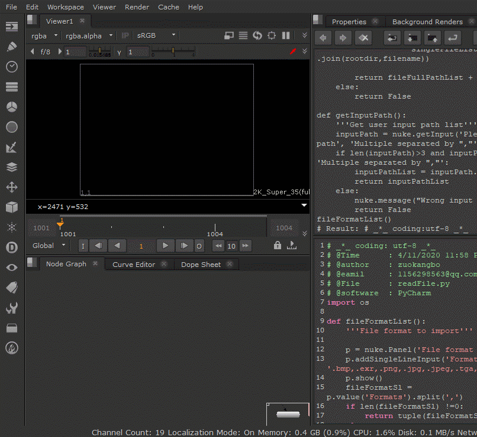

# 第7课作业
---
**编写一个函数，接受一个路径列表，为列表中的每个文件创建一个Read节点，使其能够读入该文件。**

**文件可以为单帧图片或序列帧，如果是序列帧的话，要求可以读取整个序列帧范围并能正常播放。**

为了能正确播放序列帧，需要考虑序列帧的帧范围，因此可以在路径列表里使用元组，分别指定序列帧的路径和帧范围，
请参考在Nuke中使用Read节点读入序列帧时，Read节点的file是如何显示的。

注意，你应当在创建Read节点的同时就为其设置好所有的内容，包括file和帧范围。

-------
# 完成后运行效果
